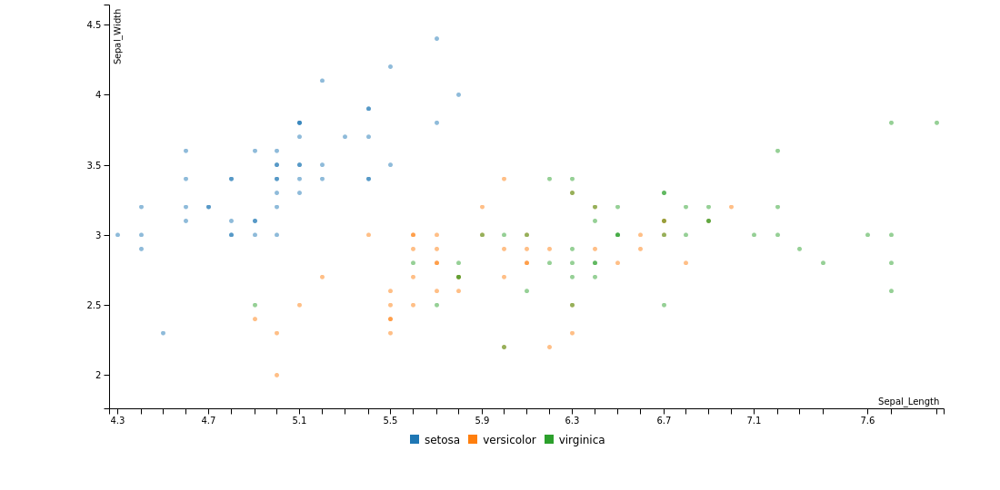

# pier


The `c3` package is a wrapper, or [htmlwidget](http://www.htmlwidgets.org/), for the [c3](http://c3js.org/) javascript charting library by [Masayuki Tanaka](https://github.com/masayuki0812). You will find this package useful if you are wanting create a chart using [R](https://www.r-project.org/) for embedding in a Rmarkdown document or Shiny App.  

The `c3` library is very versatile and includes a lot of options. Currently this package wraps most of the [options object](http://c3js.org/reference.html). Even with this current limitation a wide range of options are available. 


## Installation

You probably already guesssed this bit.


```r
devtools::install_github("mrjoh3/c3")
```


## Usage

Please note that this pakage is under active development and may change atany time. The plots that currently work are line (and varieties), bar and scatter plots. Where possible the package tries to emulate the [Grammer of Graphics](https://books.google.com.au/books?id=ZiwLCAAAQBAJ&lpg=PR3&dq=inauthor%3A%22Leland%20Wilkinson%22&pg=PR3#v=onepage&q&f=false) used in Hadley Wickham's [ggplot2](http://ggplot2.org/).

The `c3` package is intended to be as simple and lightweight as possible. As a starting point the data input must be a `data.frame` with several options. 

  * If a `data.frame` without any options is passed all of the numeric columns will be plotted. This can be used in line and bar plots. Each column is a line or bar.
  * For more complex plots only 3 columns are used, those defined as `x`, `y` and `group`. This requires a `data.frame` with a vertical structure.

### The Basics

Where no options are supplied a simple line plot is produced by default. Where no x-axis is defined the plots are sequential. 


```r
library(c3)

data = data.frame(a=abs(rnorm(20) * 10),
                  b=abs(rnorm(20) * 10))

simple.plot <- c3(data)
```


### Piping

The package also imports the [migrittr](https://cran.r-project.org/web/packages/magrittr/vignettes/magrittr.html) piping function (`%>%`) to simplify syntax.


```r
piped.plot <- data %>%
                c3() 
```


### Bar Plots


```r
bar.plot <- data[1:10, ] %>%
  c3() %>%
  c3_bar(stacked = TRUE, rotate = TRUE)
```


## Scatter Plot


```r
scatter.plot <- data %>%
  c3(x = 'a', y = 'b') %>%
  c3_scatter()
```


```r
scatter.plot2 <- iris %>%
  c3(x='Sepal_Length', y='Sepal_Width', group = 'Species') %>% 
  c3_scatter()
```



